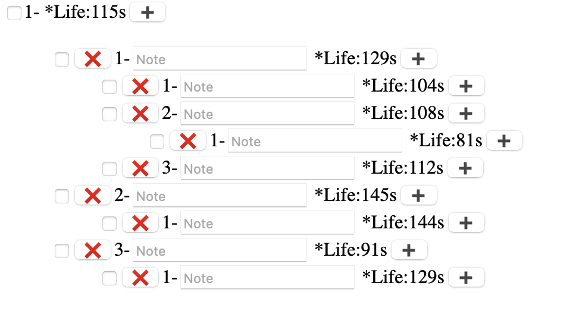
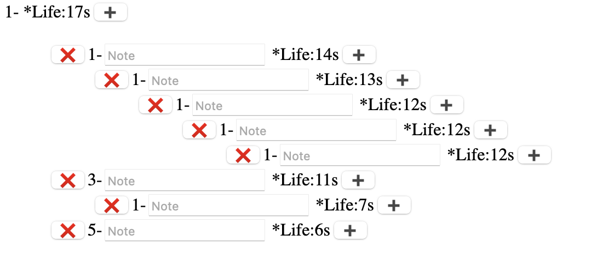

# react-tree

<!-- ## Screenshots -->

<!--  -->
## Example
online example: https://cesare12.github.io/react-tree/

## API

### Tree props

| name      | description             | type    | default |
| --------- | ----------------------- | ------- | ------- |
| checkable | whether support checked | boolean | true    |

## Installation

### Prerequisites
- npm, which you can install by running: 

    ```npm install npm@latest –g```

### How to install
* Clone the repo from this website, then
* In command line:
  * ```$ git clone https://github.com/Cesare12/react-tree.git```
  * ```$ cd react-tree```
  * ```$ npm install```
  * ```$ npm start```

 At this point you should see the app running on 

 ```http://localhost:3000```